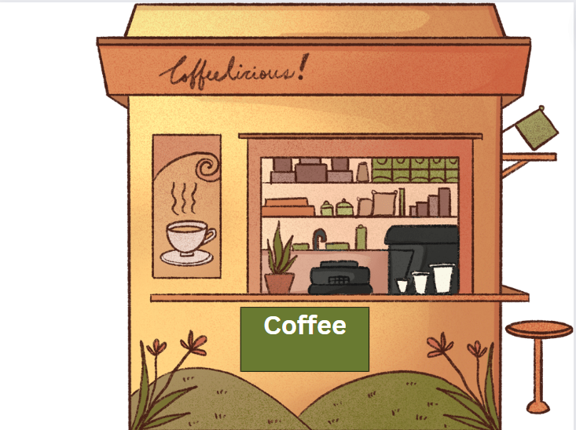
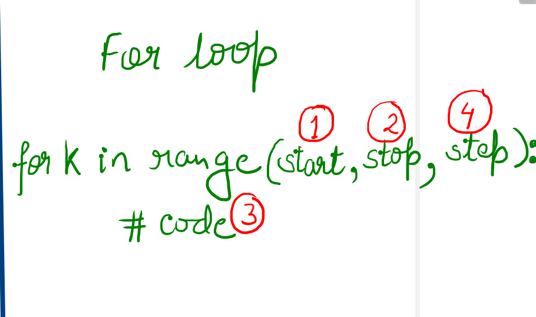

# For Loops


***Answers*: 1. Lightening, 2. Orange 3. Book, 4. Three, 5. The letter N**

- In Python, the `for` loop is used to run a block of code a certain number of times.
- It is used to iterate over any sequence such as a list, tuple, string, etc.
- **SYNTAX**➖
    
    ```python
    	for item in sequence:
        # statement(s)
    ```
    
    Here, **item** accesses each item of the sequence on each iteration. Loop continues until we reach the last item in the sequence.
    
- Flowchart➖
    
    .png)
    

## **Python for Loop with Python range()**

### `**range()**`➖ **This function returns a sequence of numbers between the given range.**

We use this function to define a range of values.

### **Syntax of range()**

The `range()` function can take a maximum of three arguments:

```python
range(start, stop, step)
```

The `start` and `step` parameters in `range()` are **optional**.

.png)

### **range() in for Loop**

```python
num=range(5);
for i in num:
	print(i)
'''
OUTPUT:-
0
1
2
3
4
'''
```

 **Note➖ if the start is not mentioned then it starts with a 0**

## How `range()` works with a different number of arguments.

### **range() with Stop Argument**➖

- It returns a sequence of numbers starting from **0** up to the number (but not including the number). For Example➖
    
    ```python
    for i in range(3):
    	print(i)
    '''
    OUTPUT-
    0
    1
    2
    '''
    ```
    
- 0 and negative numbers are not allowed.

### **range() with Start & Stop Argument**➖

- If two arguments are passed, it means they are Start and Stop only.
- It returns a sequence of numbers from Start (inclusive) ****up to the Stop (exclusive).
    
     **For example➖**
    
    ```python
    for key in range(2,5):
    	print(key)
    '''
    OUTPUT -
    2
    3
    4
    '''
    ```
    

### range() with Start, Stop and Step Arguments

- If we pass all three arguments,
    - The first argument is the `Start`
    - The second argument is the `Stop`
    - The third argument is the `Step`
- The `Step` argument specifies the incrementation between two numbers in the sequence.
- It returns a sequence of numbers from Start (inclusive) ****up to the Stop (exclusive) and the difference between numbers is of Step.

```python
for key in range(1,10,2):
	print(key)

'''
OUTPUT -
1
3
5
7
9
'''
```

**Note➖ The default value of Start is 0, and the default value of Step is 1.  That's why**

 **`range(0, n, 1)` is equivalent to `range(n)`**
.

## Examples➖



- Let’s say you want to display Coffee one time then you will print and do the print("Coffee") one time.
- Similarly, If it is two then you will write print twice
- Let’s say you want to display it 100 times. Without some sort of loop in your code, we would probably have to write the same line of code 100 times.

A *for-loop* can help us to do so by running the same code repeatedly under certain conditions.

### The sequence of Execution of For Loop



- Start -> Stop-> Loop Body/Code -> Step -> Stop -> Loop Body/Code -> Step and so one
1. The **Start** is denoted as 1, the **Stop** is denoted as 2, **Loop Body** denotes as 3, **Step** is denoted as 4.
2. Sequence of Execution will be : 1 -> 2 -> 3 -> 4 -> 2-> 3 -> 4 -> 2 -> 3 -> 4 and so on

## Examples of For Loop with Dry Run

### Example 1: Print Hello 4 times.

.png)

```python
for i in range(1,5,1):
	print("Hello")
```

### Code 1**:  Print numbers from 1 to 5**

```python
for i in range(1,6,1):
	print(i)
'''
OUTPUT
1
2
3
4
5
'''
```

### Code 2: **Print 1 to 5 in a Horizontal manner (Concatenation)**

```python
s="";
for i in range(1,6,1):
	s+=str(i)
print(s)
'''
OUTPUT 
12345
'''
```

Do the **dry run of the above code with the help of a table for better understanding and visualization.**

W**hat will happen if you put the print statement inside the for loop what will happen.**

```python
s="";
for i in range(1,6):
  s+=str(i)
  print(s)
'''
OUTPUT 
1
12
123
1234
12345
'''
```

**Do a dry run of the above code to make them visualize**

Now, instead of putting an empty string in the s put **0** and make them visualize what will be changed.

```python
s=0;
for i in range(1,6):
	s+=i
print(s)
'''
OUTPUT-
15
'''
```

Do a **dry run of the above code to make them visualize.**

### Code 3: **Run a reverse loop to print numbers from 5 to 1**

```python
for i in range(5,0,-1):
	print(i)
'''
OUTPUT
5
4
3
2
1
'''
```

### Code 4: **Run a reverse loop to print numbers from 5 to 1 in a horizontal manner**

```python
bag=""
for i in range(5,0,-1):
	bag+=str(i)
print(bag)
'''
OUTPUT
54321
'''
```

if I Want to put a **space** in between the numbers 

```python
bag=""
for i in range(5,0,-1):
	bag+=str(i)+" "
print(bag)
'''
OUTPUT
5 4 3 2 1
'''
```

### Code 5: **Solve a factorial problem using the for loop**

```python
fact=1;
for i in range(1,6):
	fact=fact*i;
print(fact);
# 120
```

Do the **dry run of the above code to make them understand**

### Code 6: **Calculate the sum of even numbers from 1 to 50**

```python
start=1;
end=51;
sum=0;
for k in range(start,end):
	if(k%2==0):
		sum=sum+k;
print(sum);  # 650
```

Do the **dry run of the above code so that they can visualize.**

### Code 7: **Calculate the sum of even numbers from 1 to 50 and odd numbers from 1 to 50.**

```python
start=1;
end=51;
sum_even=0;
sum_odd=0;
for i in range(start,end):
	if(i%2==0):
		sum_even=sum_even+i;
	else:
		sum_odd=sum_odd+i;
print(sum_even+sum_odd); #1275
```

Do the **dry run of the above code so that they can visualize.**

## Break & Continue

**Story**➖ 

***Guests Coming*** ➖There are 10 guests coming to my home, After 2-3 days they decided to leave their home. They all have the train on the same day and at the same time. I need to drop them off at the railway station but I have one bike which can only take one person at a time.

In this case, I need to drop each guest one by one. Taking the First guest to the railway station, dropping them off, and arriving back and following the same procedure again and again till the end.


### **Break**

It means coming out of the loop and stopping the execution.

```python
for guest in range(1,11):
	if(guest==4):
		break;
	print("Guest", guest);

'''
Output
Guest 1
Guest 2
Guest 3
'''
```

Do the dry run using a table.

### **Continue**

It ****is basically saying go back to the condition.

```python
for guest in range(1,11):
	print("Guest", guest);
	if(guest==3):
		continue;
'''
It will print all the guests as there is nothing to skip, because 
no code has been written after the "continue" statement.
'''

for guest in range(1,11):
	if(guest==3):
		continue;
	print("Guest", guest);

# This code will skip the 3rd guest.
```

### Code 8: **Predict the output of the code written below.**

```python
count=1
for k in range(1,10):
  count+=1
  if(k==5):
    continue
print(count) #Output is 10
```

### Code 9: Musical Chair Game (Continue &  Break)


```python
import random
music_S=0;
music_E=10;
randoms=int(random.random()*10)
print(randoms)
for i in range(music_S,music_E+1):
	if(randoms<i):
		continue;
	else:
		print("seat on chair");
		break;

```

## While vs For

.png)

- Write the **syntax of the while loop** and **for loop side by side** to make them visualize that both the loops are the same.

**Happy Coding!**