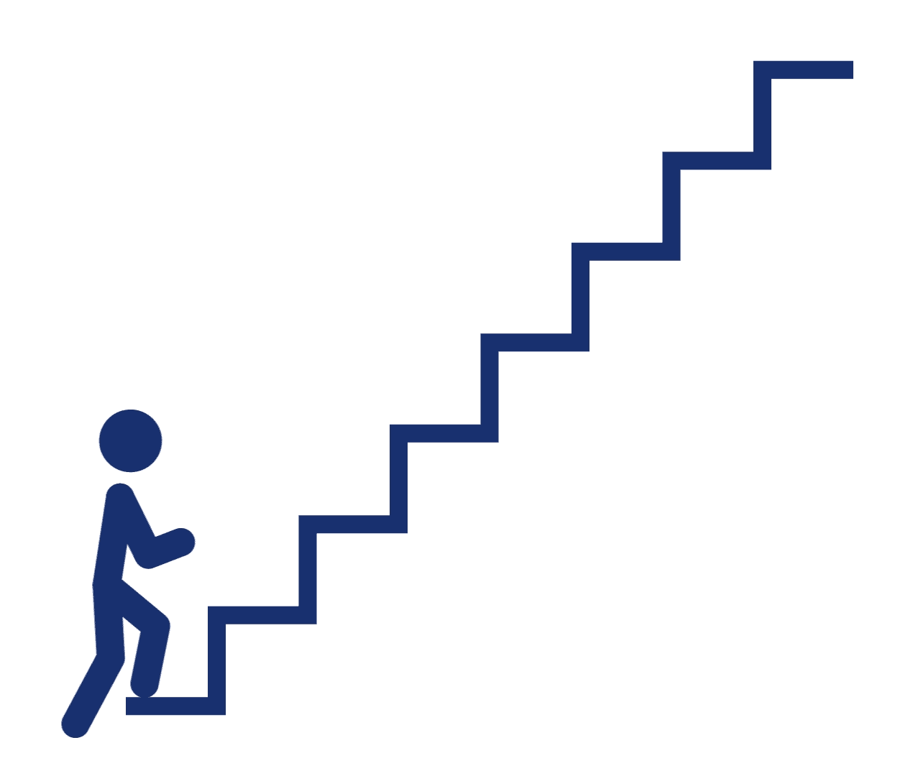
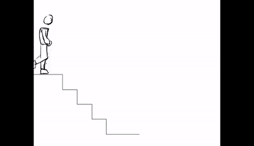
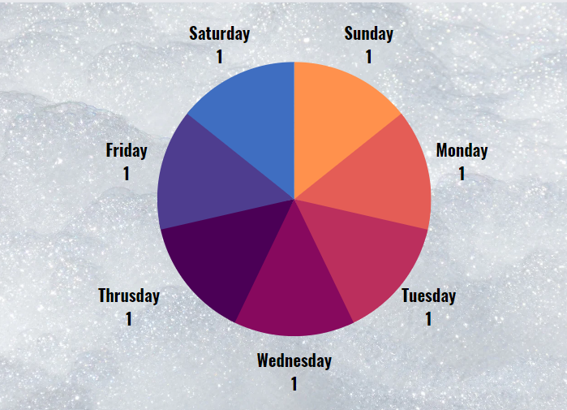
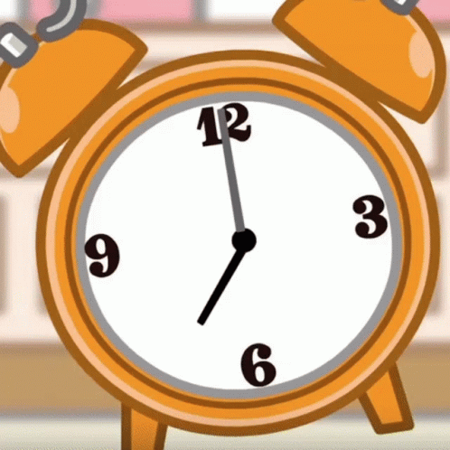
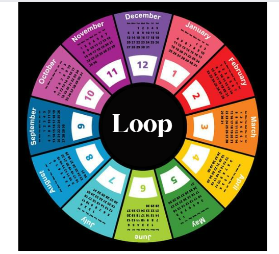
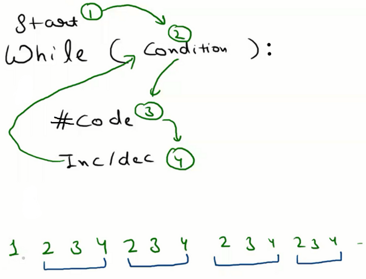

# While Loops


## **Increment and Decrement Operators in Python**

### Increment and Decrement

- **Increment means increasing the value.**
    
    
    
- **Decrement means decreasing the value.**
    
    
    

```python
#Increment

x=5;
x=x+1;
print(x); # 6 (Incrementing the value x by 1)

y=6;
y=y+4;
print(y); # 10 (Incrementing the value of y by 4)

#Decrement

x=5;
x=x-1;
print(x); # 4 (Decrementing the value x by 1)

y=6;
y=y-4;
print(y); # 2 (Decrementing the value of y by 4)
```

### Student Tasks➖

### Code 1: Play Increment-Decrement Game

```python
x=10;
x+=1;
x=x+5;
x=x+10;
print(x);   # 26
x-=10;
x=x-5;
print(x);   # 11
```

### Code 2: Find the value of a, b, c and d

```python
a=10;
c=a+1;
b=10;
d=b+1;
print(a); # 10
print(b); # 10
print(c); # 11
print(d); # 11
```

### Code 3: Find the value of a, b, c and d

```python
a=6;
b=a-1;
c=10;
d=c-1;
print(a); # 6
print(b); # 5
print(c); # 10
print(d); # 9
```

## Loops

- Take the example of **SPOTIFY or GANA.com**, there is a thing called a loop, that plays something over and over again.
    
    
    

- **Guests Coming** ➖There are 10 guests coming to my home, After 2-3 days they decided to leave their home. They all have the train on the same day and at the same time. I need to drop them off at the railway station but I have one bike which can only take one person at a time.
    
    In this case, I need to drop each guest one by one. Taking the First guest to the railway station, dropping them off, and arriving back and following the same procedure again and again till the end.
    
    .png)
    
- **Loop Examples**➖
    - ***Days of the week***➖
        
        
        
    
    ```python
    	# Sunday->Monday->Tuesday->Wednesday->Thrusday->Friday->Saturday->Sunday
    ```
    
    - ***Alarm clocks give an alarm only when they match the time or condition by a person else clock hand moving in the loop without failing.***
        
        
        
    - ***Months of the year***
        
        
        
- Python has two primitive loop commands:
    - **while loops**
    - **for loops**

## While Loop

- The while loop begins with a condition and it is written like an if statement. The inner parenthesis is the condition.
- As long as the **condition is true**, it will continue to **execute the statement(s)**.
- To **stop the loop**, the **condition must eventually become false**.
- A common condition is to have a variable be less than or greater than compared to a number.
- Within the statements, that **variable will be incremented or decremented depending on the condition**.
- **Each time** the loop is executed, **the variable will change** and eventually become larger or less than the number in the condition, stopping the loop.
- Give an example of a **1m jump till the person is reaching the 100m mark**
    
    
    

- **SYNTAX**➖
    
    ```python
    starting_point  # called as initialization
    
    while(till_when_he_will_jump):     # condition to terminate the loop
    
    	# operation that is to be performed
    
    	how_many_jump_at_a_time          # Increment/decrement
    ```
    
- **Taking the above marathon example**➖
    
    ```python
    jump=1;
    while(jump<=100):
    	print("jump");  #will print jump 100 times
    	jump=jump+1;
    ```
    
- **Dry Run of the above code for better visualization**➖
    
    
    
- Table for **DRY RUNNING**.
    
    
    .png)
    
- Dry run again after removing the increment statement to make them understand the importance of it.
- **It will run for infinite times.**
- Show it on **REPLIT.**

.png)

### **Activity Time:**

### Code 4: **Print “Hello World” 10 times.**

```python
i=1;
while(i<=10):
	print("Hello World");
	i=i+1;
```

### Code 5: **Print numbers from 1 to 5**

```python
i=1;
while(i<=5):
	print(i);
	i+=1;
```

- Do a dry run by making a table.

### Code 6: **Take the same examples and tell them if I increment by 2 then what will happen?**

```python
jump=1;
while(jump<=100):
	print("jump", jump); #will print jump 50 times
	jump=jump+2;
```

### Code 7:  **Do the Jump question by making 5 jumps.**

```python
jump=1;
while(jump<=100):
  print("jump", jump); 
  jump=jump+5;
```

### Code 8**:** **Do the Jump question by making 15 jumps.**

```jsx
jump=1;
while(jump<=100):
	print("jump", jump); 
	jump=jump+15;
```

## Note➖ **You can start from any point not necessarily from 1 or 0.**

### **Talk about Reverse Loops also, using the decrement operation,**

**taking the same marathon example, make them think about the condition as well.**

### **Code 8: Reverse Loop from 100 to 0 [ 1 unit jump at a time ]**


```python
position = 100;
while(position>=0):
  print("Current Position",position);
  position = position - 1
```

### Sending Notice to 1000 Employees

.png)

## Break & Continue

### Break

- **Break** means to come out of the loop and stop the execution.
- **Guest Analogy**
    - There are 10 guests coming to my home, After 2-3 days they decided to leave their home.
    - They all have the train on the same day and at the same time.
    - I need to drop them off at the railway station but I have one bike which can only take one person at a time.
    - In this case, I need to drop each guest one by one.
    - Taking the First guest to the railway station, dropping them off, and arriving back and following the same procedure again and again till the end.
    - Suppose I took the First Guest and dropped him to the Railway station and come back.
    - Again I took the Second Guest and follow the same.
    - Now, Next, I took the third guest to the Railway station and found that Train has gone.
    
    
    
    **So, Will I continue the above procedure or stopped it?**
    
    Obviously, I will stop it and wait for tomorrow.
    

### **Code 9: Loop from 0 to 10 (using break)**

```python
guest=1;
while(guest<=10):
	if(guest==4):
		break;
	print("Guest", guest);
	guest+=1;

'''
Output

Guest 1
Guest 2
Guest 3
'''
```

- Do the dry run using a table.

### Continue

- **Continue** is basically saying go back to the condition.
- **Guest Analogy**
    - There are 10 guests coming to my home, After 2-3 days they decided to leave their home.
    - They all have the train on the same day and at the same time.
    - I need to drop them at the railway station but I have one bike which can only take one person at a time.
    - In this case, I need to drop each guest one by one.
    - Taking the First guest to the railway station, dropping them off, and arriving back and following the same procedure again and again till the end.
    - Suppose I took the First Guest and dropped him to the Railway station and come back.
    - Again I took the Second Guest and follow the same.
    - Suppose the third guest is Sick, In that case, I will skip him.
    - and I will continue with the fourth guest and follow the same procedure.

### **Code 10: Loop from 0 to 10 (using continue)**

```python
guest=0;
while(guest<=10):
  guest+=1;
  if(guest==3):
	  continue;
  print("Guest", guest);
```

### **Code 11 : Find Sum of 1 to 10**

```python
'''Problem:
		Sum of 1 to 10
		1 + 2 + 3....... + 10  '''

var i = 1;
var sum = 0;

while(i<=10)
{
  sum = sum+i;
  i++;
}

console.log(sum);
```

## The else Statement with While in Python

With the else statement we can run a block of code once when the condition no longer is true:

```python
i = 1
while i < 6:
  print(i)
  i += 1
else:
  print("i is no longer less than 6")
```

# IW Assignment

### **Code 12:** Problem 1: Print the numbers from the given starting point till the ending point (including both start and end)

```python
starting = 5;
ending = 25;
while(starting<=ending):
	print(starting);
	starting+=1;
```

### **Code 13:** Problem 2: Print the odd numbers from 0 till the given limit

```python
start = 2;
limit = 50;
while(start<limit):
  if(start % 2 == 1):
    print(start);
  start = start + 1;
```

### **Code 14:** Problem 3: Print the sum of all the multiples of 3 from 0 to the given limit

```python
start = 0;
limit = 20;
sum = 0
while(start<=limit):
  if(start % 3 == 0):
    sum=sum+start;
  start=start+1
print(sum);
```

### **Code 15:** Problem 4: Print the average of even numbers from 1 to 100 (both included)

```python
starting = 1;
ending = 100;
sum_of_even = 0;
count_even_numbers = 0;
while(starting<=ending):
  if(starting%2 == 0):
    sum_of_even = sum_of_even + starting;
    count_even_numbers+=1;
  starting+=1;
average = sum_of_even/count_even_numbers
print(average);
```

**Happy Coding!**