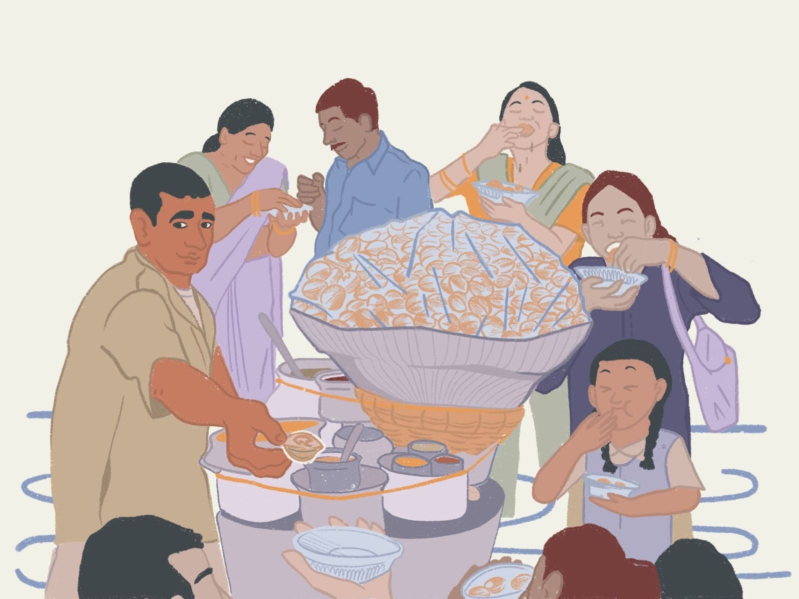
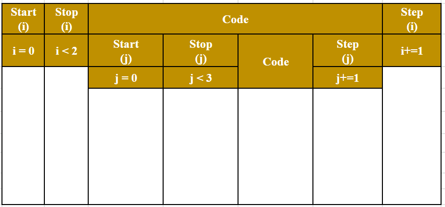

# Nested Loops


## **Nested Loops**

[nestedLoop.mp4](Images/nestedLoop.mp4)

- A **nested loop** is a loop within a loop.
- **Analogy**➖
    - Suppose you went to a Gol Gappa Shop and you ate 4 gol-gappas in a sequence. You can consider this as a loop where you have eaten 4 gol gappas in a sequence.
    - In another scenario, Suppose you went to a Gol Gappas Shop with 5 other family members. Each Member of the family ate 4 gol-gappas. You can consider this as a loop of 4 gol-gappas which run 5 times because of the 5 family members.



## Calendar Example - Nested Loop


## Week Repetition - Nested Loop


The "**inner loop**" will be executed one time for each iteration of the "**outer loop**":

- **SYNTAX**➖
    
    
    

## Dry Run of problem

### **Code 1: Nested loops for Gol Gappa example.**

```python
for family in range(1,6,1):
  for gappas in range(1,5,1):
    print(family," ate ",gappas," Gol-Gappa");
```

Dry run of the above code by making a table.

### Code 2: Grandfather and Sam are on their farm. Grandfather asked Sam to pick all the apples that are there and keep them in the basket.

Show them the visual given below.

**Version 1**

[](https://www.canva.com/design/DAFTsm4D8CM/4p3pwjRhjA6yA9yVFGF7og/view?utm_content=DAFTsm4D8CM&utm_campaign=designshare&utm_medium=link&utm_source=homepage_design_menu)

**Version 2**

[](https://www.canva.com/design/DAFUvJnGdeI/vnr_5GV7ho3-mlVE9OphPw/view?utm_content=DAFUvJnGdeI&utm_campaign=designshare&utm_medium=link&utm_source=homepage_design_menu)

### Code 3:  **Print “Hello” in vertical order using a nested loop.**

```python
for i in range(2):
  for j in range(3):
    print("Hello");
```

Dry run of the above code by making a table.



### Code 4:  **Print “Hello” in horizontal order using a nested loop.**

```python
for i in range(2):
  bag=""
  for j in range(3):
    bag+="Hello"+" "
  print(bag);
```

Dry run of the above code by making a table.


## Father-Son Marathon


There was a father who trains his son for the next Olympics running competition. Every day Father used to give some targets to his son

### Code 5:  **Father gave the son a target, of completing 10 sets. Each set contains 10 Rounds of a field.**

```python
for father in range(1,11):
  for son in range(1,11):
    print("Father count", father,", Son completed ", son);
```

### **Let’s listen to a  story:**

Once upon a time,  a father and son were farmers. They once decided that they do plantation of trees in their field. Since Father is very old, he is unable to do that much work whereas the son is proactive, that’s why the father’s responsibility is to make sure how many fields are done whereas the son has the responsibility of putting the seeds in the field.


### **Code 6: Father has 5 fields. Each field son needs to put 10 seeds**

```python
 ''' 
	**********
  **********
  **********
  **********
  **********
 '''

for father in range(5):
  bag = "";
  for son in range(10):
    bag = bag + "*";
  print(bag);
```

### **Code 7:  Father has 5 fields. Son needs to put the seeds in increasing order.**

Field 1 → 1 seed

Field 2 → 2 seed

Field 3 → 3 seed

Field 4 → 4 seed

Field 5 → 5 seed

```python
'''
* 
* * 
* * * 
* * * * 
* * * * *
'''

for father in range(1,6):
  bag = "";
  for son in range(father):
    bag = bag + "* ";
  print(bag);
```

### Code 8: Print the below pattern

```python
'''
1
1 2
1 2 3
1 2 3 4
1 2 3 4 5
'''

for father in range(1,6):
  bag = "";
  for son in range(1,father+1):
    bag = bag+str(son)+" ";
  print(bag);
```

### **Code 9: Father has 5 fields. Son needs to put the seeds in decreasing order.**

Field 1 → 5 seed

Field 2 → 4 seed

Field 3 → 3 seed

Field 4 → 2 seed

Field 5 → 1 seed

```python
'''
* * * * *
* * * *
* * *
* *
*
'''

for father in range(5,0,-1):
  bag = "";
  for son in range(father):
    bag = bag + "* ";
  print(bag);
```

### **Code 10: Print the below reverse pattern**

```python
'''
1 2 3 4 5
1 2 3 4
1 2 3
1 2
1
'''

for father in range(5,0,-1):
  bag = "";
  for son in range(1,father+1):
    bag = bag+str(son)+" ";
  print(bag);
```

### **Code 11: Combining Code 8 and Code 10 to form a pyramid.**

```python
'''
1
1 2
1 2 3
1 2 3 4
1 2 3 4 5
1 2 3 4
1 2 3
1 2
1
'''
for father in range(1,6):
  bag = "";
  for son in range(1,father+1):
    bag = bag+str(son)+" ";
  print(bag);
for father in range(4,0,-1):
  bag = "";
  for son in range(1,father+1):
    bag = bag+str(son)+" ";
  print(bag);
```

## Nested Loop with While

### **Code 12: Use While Loop. Print the below pattern**

```python
 ''' 
	**********
  **********
  **********
  **********
  **********
 '''

father=1;
while(father<=6):
  son=1;
  bag = "";
  while(son<=10):
    bag=bag+"*";
    son+=1;
  print(bag);
  father+=1;
```

## Break and Continue

### Break

Sultan and Bahubali were good friends, but Sultan was the king whereas Bahubali doesn’t have any kingdom. Later Sultan gave one part of his empire to Bahubali with a condition that Bahubali will never try to cross the status of Sultan and if he tries then he will attack the Prithviraj clan.


### **Code 13: Using Break**

```python
for sultan in range(1,11):
  for bahuballi in range(1,11):
    if(bahuballi>sultan):
      break
    print("sultan=",sultan," bahuballi=",bahuballi);
```

In the above code, whenever the value of Bahubali becomes greater than Sultan, At that point, the inner loop of Bahubali will break [ **It means Sultan attacked his clan because Bahubali betray him, by not following his conditions**]

### Continue

The below code gives the same output as the above code but the only difference is on break is that the execution will stop completely but in case of continuing the process will keep on skipping the step and execution will end only once the loop will be done.

### **Code 14: Using Continue**

```python
for sultan in range(1,11):
  for bahuballi in range(1,11):
    if(bahuballi>sultan):
      continue
    print("sultan=",sultan," bahuballi=",bahuballi);

```

### **Code 15: Print the below pattern**

```python
'''
1
*
1 2
* *
1 2 3
* * *
1 2 3 4
* * * *
1 2 3 4 5
* * * * *
'''

for father in range(1,6):
  bag1 = "";
  for son in range(1,father+1):
    bag1 = bag1+str(son)+" ";
  print(bag1)
  bag2 = "";
  for son2 in range(1,father+1):
    bag2 = bag2+"*"+" ";
  print(bag2)
```

# **IW Assignment**

### **Code 16 :** **Print Prime Numbers from 1 to given limit**

```python
# Problem 2: Print Prime Numbers from 1 to the given limit

limit = 20;
for number in range(1,limit+1):
  factors=0;
  for i in range(1,number+1):
    if(number%i==0):
      factors+=1;
  if(factors == 2):
    print(number,"is a prime number");
  else:
    print(number, "is not a prime number");
```

### **Code 17 :** **Print a box pattern**

```python
'''Problem 3: Print a box pattern using *

**********
*        *
*        *
*        *
*        *
*        *
*        *
*        *
*        *
********** 
'''

for i in range (1,11):
  bag="";
  for j in range(1,11):
    if(i==1 or i==10):
      bag = bag + "*";
    else:
      if(j==1 or j==10 ):
        bag = bag+"*";
      else:
        bag = bag+" ";

  print(bag);
```

**Happy Coding!**